# CGRA 2020/2021

## Group T06G06

## Screenshots

### 1 - MyFish

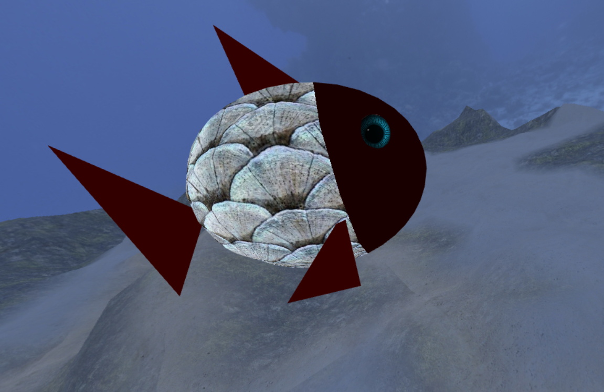

### 2 - Sea Floor

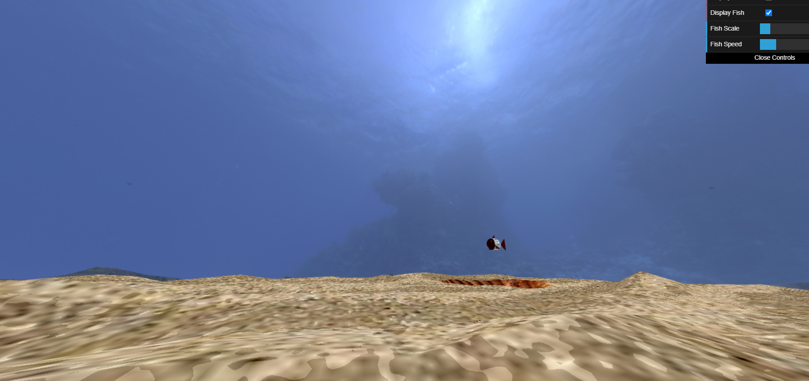

### 3 - Water Surface

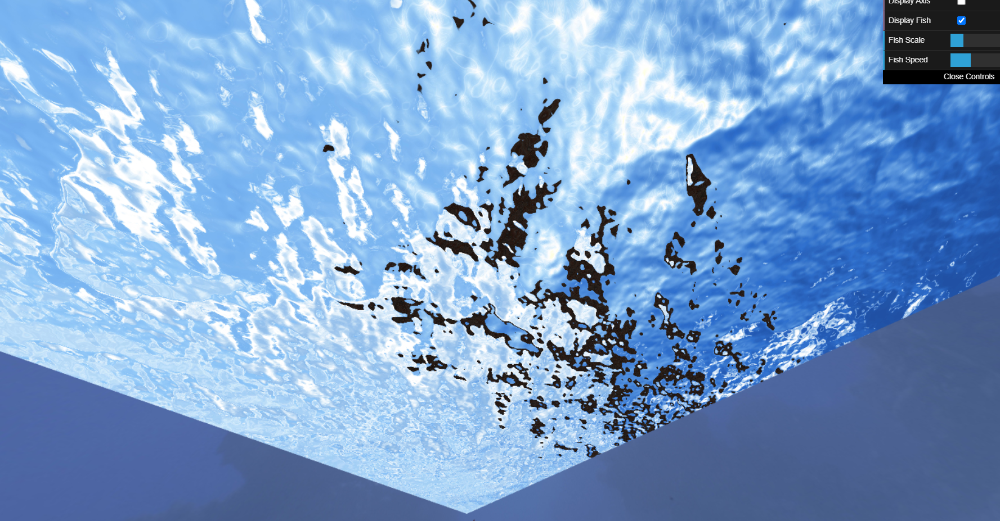

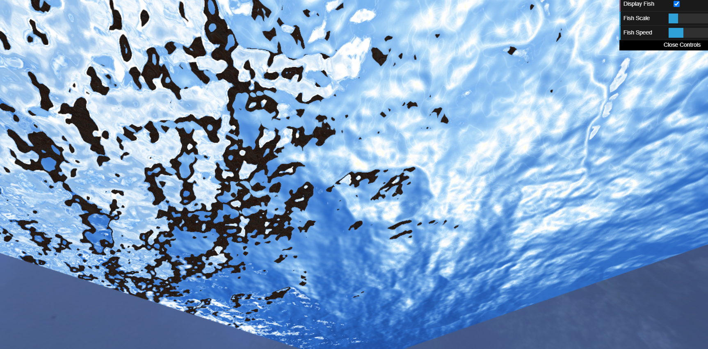

### 4 - Rocks

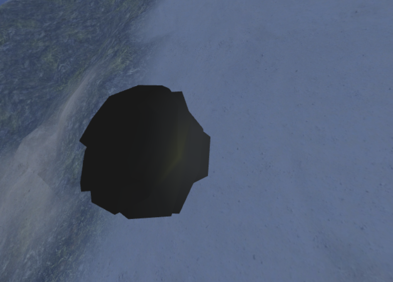

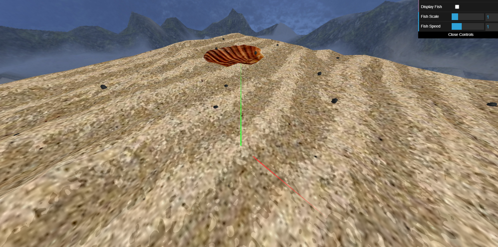

### 5 - Pillars

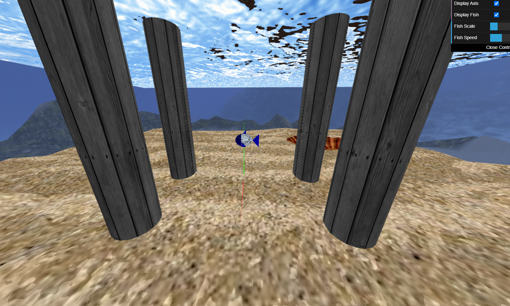

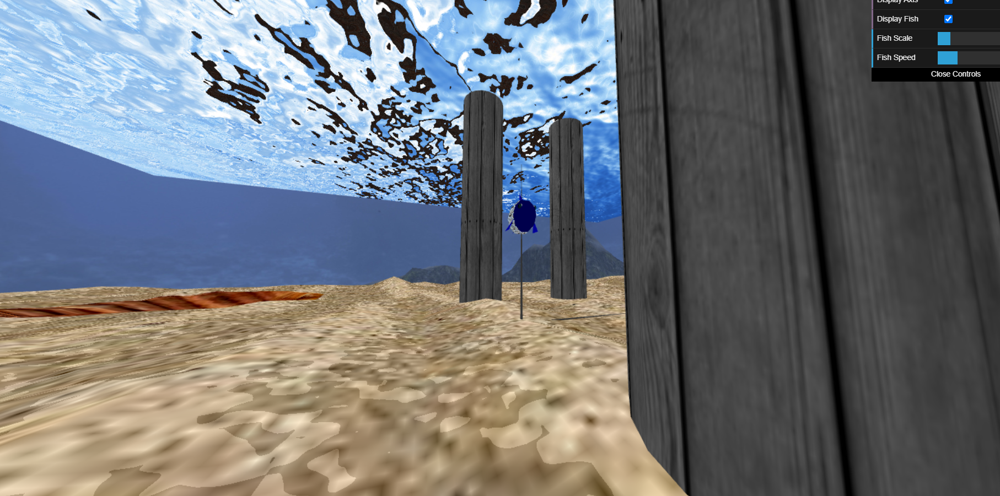

### 6 - Other Elements

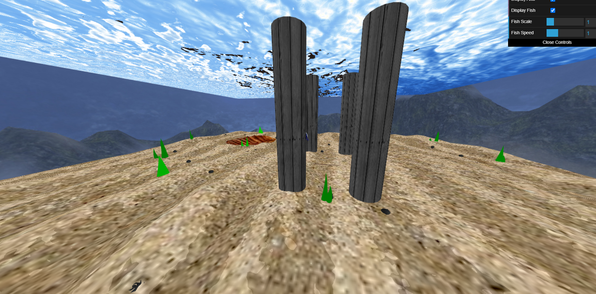

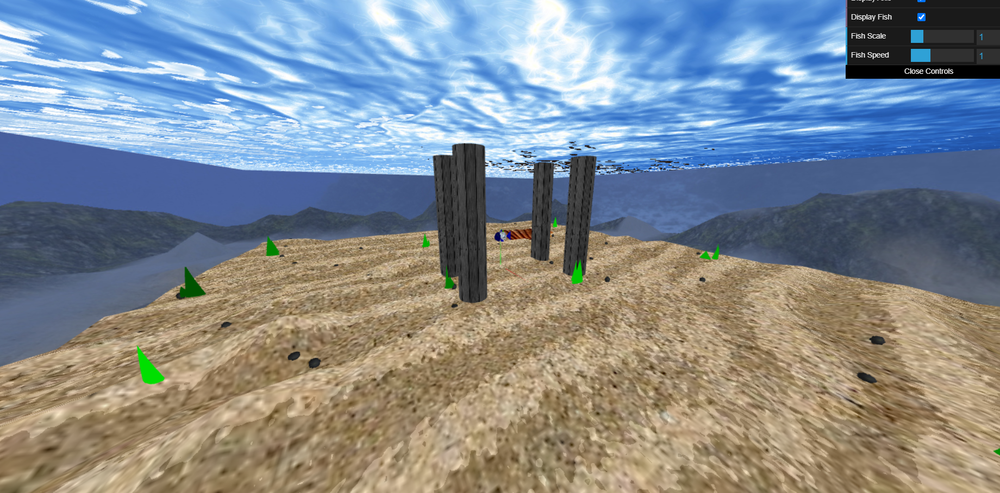

### 7 - Rock Picking

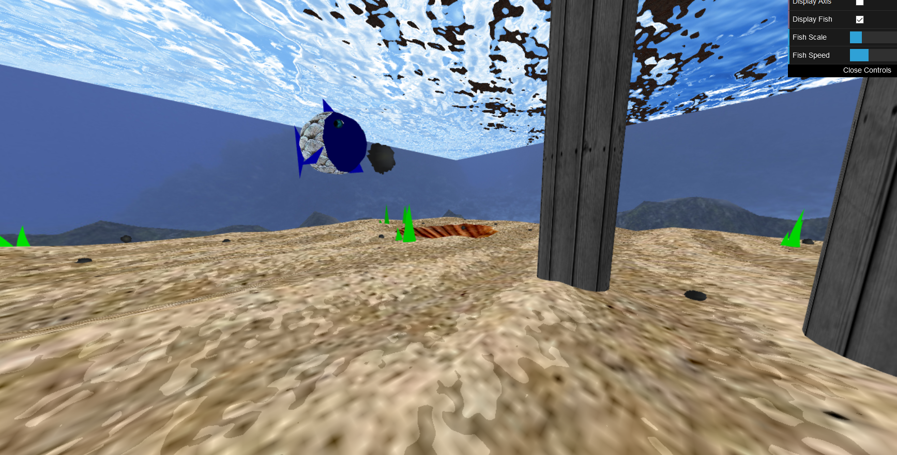

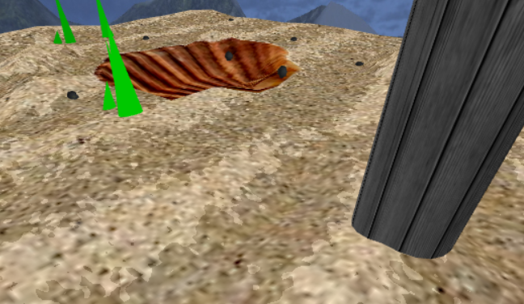

### 8 - Additional Functionalities

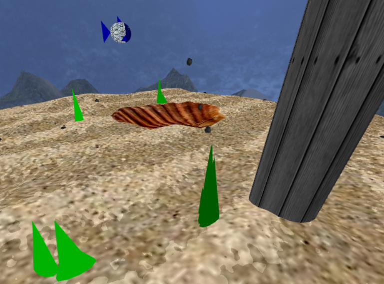

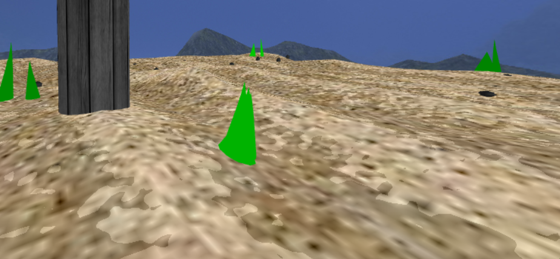

