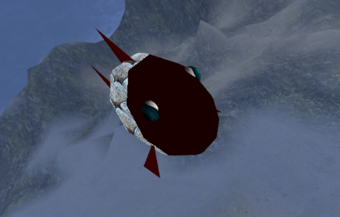

# CGRA 2020/2021

## Group T06G06

## Screenshots

### 1 - MyFish

### 2 - Sea Floor

### 3 - Water Surface

### 4 - Rocks

### 5 - Pillars

### 6 - Other Elements

### 7 - Rock Picking

### 8 - Additional Functionalities

